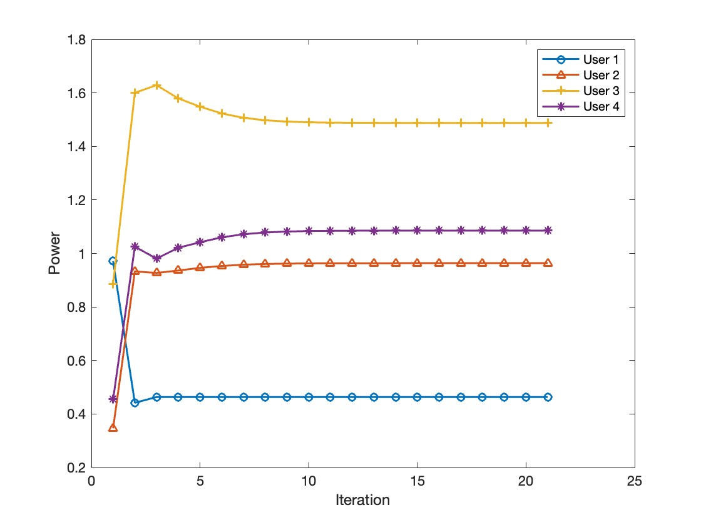
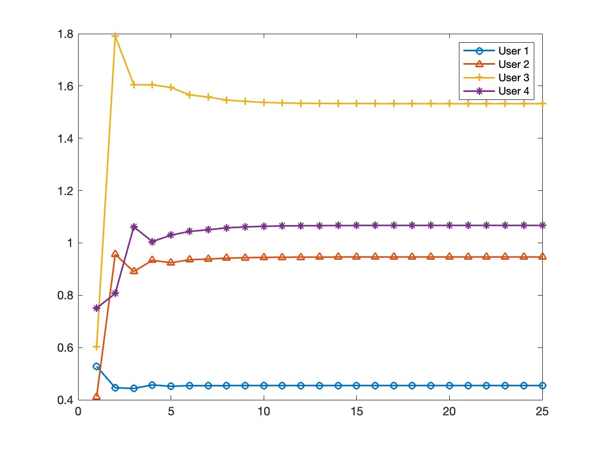
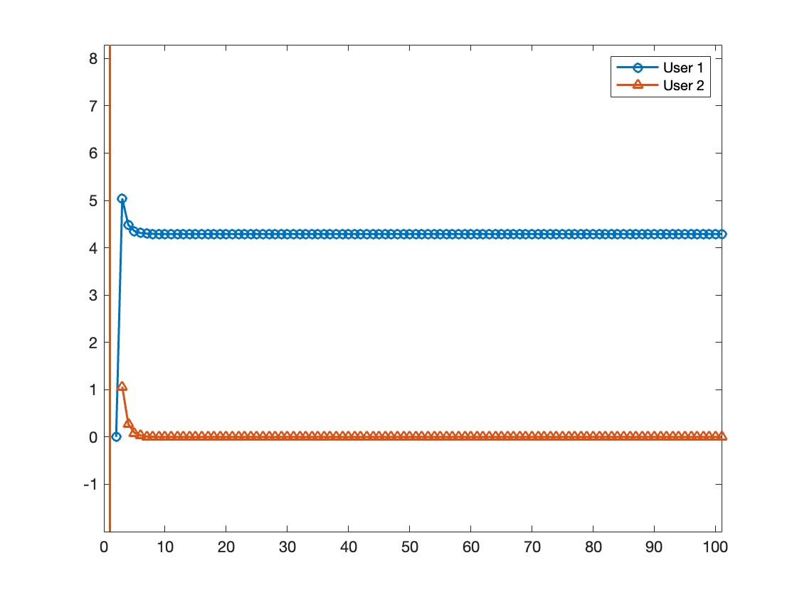

# 1. Wireless Reliability Fairness Optimization

The following problem is found in Chapter 3 of the monograph [Wireless Network Optimization by Perron-Frobenius Theory](https://www.nowpublishers.com/article/Details/NET-048).

## 1.1. The Problem Statement
An outage event occurs at the $l$th receiver when the received SINR falls below a given reliability threshold, i.e., $\text{SINR}_l(\mathbf{p})<\beta_l$ for $l=1, \ldots, L$. So we are interested in minimizing the worst-case outage probability to ensure reliability fairness, which is formulated as follows:

$$\text{minimize} \max_l P(\text{SINR}_l(\mathbf{p})<\beta_l)$$

$$\text{subject  to}: \mathbf{p} \in \mathcal{P}$$

$$\text{variables}:   \mathbf{p} .$$

where $\text{SINR}_l(\mathbf{p})=R\_{ll}G\_{ll} p_l/(\sum\_{j \neq l}R\_{lj}G\_{lj}p_j+n\_{l})$ for all $l$ where $R\_{lj}, \forall l, j$ are random variables that model fading, and $\mathbf{p} \in \mathcal{P}$ models general power constraint set, e.g., a single total power constraint.

## 1.2. Analytical Solution
Under the Rayleigh fading model, the above nonconvex stochastic program can be simplified because the outage probability (please see [Kandukuri and Boyd TWC 2002](http://www.stanford.edu/~boyd/papers/outage.html) for more details) of the $l$th receiver can be given analytically by:

$$P(\text{SINR}_l(\mathbf{p})<\beta_l)=1-e^{\frac{-v_l \beta_l}{p_l}} \prod\_{j \neq l}(1+\frac{\beta_l F\_{l j} p_j}{p_l})^{-1},$$

where

$$F\_{l j} = 
\begin{cases}
0, & l=j, \\
G\_{lj} / G\_{ll},& i \neq j. \\
\end{cases}
$$

$$ \mathbf{v}=(\frac{n_1}{G_{11}}, \cdots, \frac{n_L}{G\_{LL}})\^{\top}. $$

Next, we give an analytical solution by applying nonnegative matrix theory and nonlinear Perron-Frobenius theory. For illustration, consider the single total power constraint, then the optimal value and solution are, respectively, given as follows:

$$1-e\^{-\rho(\mathbf{B}(\mathbf{p}^*)+\frac{1}{\bar{p}} \mathbf{v} \mathbf{1}^{\top})},$$

$$\mathbf{p}^*=\mathbf{x}(\mathbf{Bp}^\*+\frac{1}{\bar{p}} \mathbf{v} \mathbf{1}^{\top})),$$

where $\mathbf{x}(\cdot)$ is the right eigenvector corresponding to the Perron-Frobenius eigenvalue $\rho(\cdot)$, and we define

$$B\_{l j} = 
\begin{cases}
0, & l=j, \\
\frac{p_l}{p_j} \log (1+\frac{\beta_l F\_{l j} p_j}{p_l}),& l \neq j. \\
\end{cases}
$$

Observe that the spectrum of $\mathbf{B}$ and its rank-one perturbation capture the optimality entirely. Interestingly, this nonlinear Perron-Frobenius theory approach solves an open problem in [Kandukuri and Boyd TWC 2002](http://www.stanford.edu/~boyd/papers/outage.html) for the interference-limited special case.

## 1.3. The Algorithm
Using the nonlinear Perron-Frobenius theory, an optimal algorithm is given below to solve the stochastic program:
1) Update Power $\mathbf{p}(k+1)$:
   
$$
p_l(k+1)=-\log P(\text{SINR}_1(\mathbf{p}(k))>\beta_l) p_l(k) \quad \forall l .
$$

2) Nomalize Power $\mathbf{p}(k+1)$:

$$\mathbf{P}(k+1) \leftarrow \frac{\mathbf{p}(k+1) \cdot \bar{p}}{\mathbf{1}^{\top} \mathbf{p}(k+1)} \quad \text { if } \quad\mathcal{P}=\lbrace \mathbf{p} \mid \mathbf{1}^{\top} \mathbf{p} \leq \bar{p} \rbrace.$$

$$ \mathbf{P}(k+1) \leftarrow \frac{\mathbf{p}(k+1) \cdot \bar{p}}{\max_{j} p_j(k+1)} \quad \text { if } \quad \mathcal{P}=\lbrace \mathbf{p} \mid p_l\leq \bar{p},\quad \forall l \rbrace.$$

## 1.4. The MATLAB Code
Below is an example of using our matlab code to solve the stochastic problem with a single total power constraint:\\

%======================

G = [3.1929    0.1360    0.2379  0.3;
    0.0702    2.8835    0.2436   0.3;
    0.1702    0.8835    2.4436   0.3;
    0.0693    0.0924    0.3060   2.3];
    
n = [0.05;0.05;0.05;0.05];

beta = [1;2;2;2];

pmax = 4;

[p,power_evolution]=worst_outage_prob_min(G,n,beta,pmax);

plot(1:1:res_len,power_evolution(:,1),'-o',1:1:res_len,power_evolution(:,2),'-^',1:1:res_len,power_evolution(:,3),'-+',1:1:res_len,power_evolution(:,4),'-*','linewidth',1.5);

legend('User 1','User 2','User 3','User 4');

%======================

# 2. Max-min Weighted SINR Optimization : Analytical solution and Algorithm

The following problem is found in Chapter 3 of the monograph [Wireless Network Optimization by Perron-Frobenius Theory](https://www.nowpublishers.com/article/Details/NET-048).

## 2.1. The Problem Statement
Maximizing the minimum weighted signal-to-interference-and-noise radio (SINR) under the total power constraint is formulated as follows :

$$\text{maximize} \min_l\frac{\text{SINR}_l(\mathbf{p})}{\beta_l}$$

$$\text{subject  to}: \mathbf{1}^{\top} \mathbf{p} \leq \bar{p}, \mathbf{p}\geq \mathbf{0},$$

$$\text{variables}:   \mathbf{p} .$$

where  $\text{SINR}_l(\mathbf{p})=G\_{ll} p_l/(\sum\_{j \neq l}G\_{lj}p_j+n\_{l})$  for all $l$, and $\boldsymbol{\beta}=\left(\beta_1, \ldots, \beta_L\right)^{\top} \geqslant 0$ is a given weight vector to reflect priority among users (larger weight means higher priority). A total power budget is given by $\bar{p}$.

## 2.2. Analytical Solution
Let us define the following nonnegative matrix:

$$
\mathbf{B}=\mathbf{F}+(1 / \bar{p}) \mathbf{1 1}^{\top},
$$

and denote

$$ \mathbf{v}=(\frac{n_1}{G_{11}}, \cdots, \frac{n_L}{G\_{LL}})\^{\top}, $$

$$F\_{l j} = 
\begin{cases}
0, & l=j, \\
G\_{lj} / G\_{ll}, &i \neq j. \\
\end{cases}
$$

The optimal value and solution are given, respectively, by

$$
\gamma^*=\frac{1}{\rho({diag}(\boldsymbol{\beta} \cdot \mathbf{v}) \mathbf{B})},
$$

and

$$
\mathbf{P}^*=\left(P / \mathbf{1}^{\top} \mathbf{x}({diag}(\boldsymbol{\beta} \circ \mathbf{v}) \mathbf{B})\right) \mathbf{x}({diag}(\boldsymbol{\beta} \circ \mathbf{v}) \mathbf{B}),
$$

where $\circ$ denotes Schur product and $\mathbf{x}(\cdot)$ denotes the right eigenvector corresponding to the Perron-Frobenius eigenvalue $\rho(\cdot)$.
## 2.3. A Short Proof Using the Classical Linear Perron-Frobenius Theorem
It can be shown that solving the optimization problem is equivalent to solving the following fixed-point equation:

$$
\frac{1}{\gamma^\*} \mathbf{p}^\*={diag}(\boldsymbol{\beta} \circ \mathbf{v})\left(\mathbf{F} \mathbf{p}^\*+\mathbf{1}\right), \quad \mathbf{1}\^{\top} \mathbf{p}^\*=\bar{P}.
$$

Now, observe that:

$$
\frac{1}{\gamma^\*} \mathbf{p}^\*={diag}(\boldsymbol{\beta} \circ \mathbf{v})\left(\mathbf{F}+\frac{1}{\bar{P}} \mathbf{1 1}^{\top}\right) \mathbf{p}^\*.
$$

Therefore the problem can be solved analytically as an eigenvalue problem by the classical linear Perron-Frobenius theorem.

## 2.4. The MATLAB Code
Below is an example of using our matlab code to solve the problem:

%======================

G = [3.1929    0.1360    0.2379  0.3;
    0.0702    2.8835    0.2436   0.3;
    0.1702    0.8835    2.4436   0.3;
    0.0693    0.0924    0.3060   2.3];
    
n = [0.05;0.05;0.05;0.05];

beta = [1;2;2;2];

pmax = 4;

[p,power_evolution]=maxmin(G,n,beta,pmax);

plot(1:1:res_len,power_evolution(:,1),'-o',1:1:res_len,power_evolution(:,2),'-^',1:1:res_len,power_evolution(:,3),'-+',1:1:res_len,power_evolution(:,4),'-*','linewidth',1.5);

legend('User 1','User 2','User 3','User 4');

%======================

# 3. Outer Approximation Algorithm for Sum Rate Maximization Perron-Frobenius Theory.

The following problem is found in Chapter 5 of the monograph [Wireless Network Optimization by Perron-Frobenius Theory](https://www.nowpublishers.com/article/Details/NET-048).

## 3.1. The Problem Formulation

The weighted sum rate maximization problem in a multiuser Gaussian interference channel subject to affine power constraint can be stated as:

$$
\text{ maximize } \sum\_{l=1}^L w_l \log \left(1+\text{SINR}_l(\mathbf{p})\right)
$$

$$
\text { subject to } \mathbf{a}_l\^{\top} \mathbf{p} \leqslant \bar{p}_l, \quad l=1, \ldots, L, 
$$

$$
\text { variables: } \mathbf{p},\quad\quad \quad \quad \quad \quad \quad \quad \quad \quad
$$

where $\mathbf{w}=(w_1,…,w_L) \geq \mathbf{0}$ is a given probability vector, and $w_l$ is a weight assigned to the $l$th link to reflect priority (a larger weight reflects a higher priority). The power budget constraint set is modeled by the nonnegative vectors $\mathbf{a}_l,l=1,…,L$ and the upper bound $\bar{\mathbf{p}}$.

Let us denote $\gamma$ as the SINR vector of the users, i.e., $\gamma=\left(\gamma_1, \ldots, \gamma_L\right)^{\top}>0$. The weighted sum rate maximization problem is equivalent to the following problem:

$$
\text{ maximize }  \sum_{l=1}^L w_l \log (1+\gamma_l) \quad  \quad \quad \quad \quad \quad \quad \quad \quad \quad\quad\quad
$$

$$
\text{ subject to } \rho\left({diag}(\gamma)\left(\mathbf{F}+\left(1 / p_l\right) \mathbf{v a}_l\^{\top}\right)\right) \leqslant 1, \quad l=1, \ldots, L, 
$$

$$
\text{ variables: } \mathbf{p},\quad\quad \quad \quad \quad \quad \quad \quad \quad \quad\quad\quad\quad\quad\quad\quad\quad
$$

where $\rho(⋅)$ denotes the Perron-Frobenius eigenvalue function and whose optimal $\gamma$ yields the original optimal $\mathbf{p}$ through a Perron-Frobenius eigenvector relationship. Now, let $\tilde{\mathbf{\gamma}} =\log\mathbf{\gamma}$.
Then, the weighted sum rate maximization problem can be further rewritten as:

$$
\text{ maximize }  \sum_{l=1}^L w_l \log \left(1+e^{\tilde{\gamma}_l}\right) \quad\quad \quad \quad \quad \quad \quad \quad \quad \quad\quad\quad\
$$

$$
\text{ subject to } \rho(diag(e\^{\tilde{\gamma}})(\mathbf{F}+(1/\bar{p}_l)\mathbf{va}\^{\top}))\leq 0,\quad l=1, \ldots, L,
$$

$$
\text{ variables: }\tilde{\gamma},\quad\quad \quad \quad \quad \quad \quad \quad \quad \quad\quad\quad\quad\quad\quad\quad\quad\quad\quad
$$

which, notably, maximizes a convex objective function over a closed unbounded convex set.

## 3.2 The MATLAB Code 

Our approach is as follows: The feasible region containing the optimal extreme point is first embedded inside a compact polyhedral convex set (the tightest possible that is ensured by fundamental results in nonnegative matrix theory and the Perron-Frobenius theorem). Infeasible regions are then successively removed from this initial polyhedral set. This method generates a nested sequence of polyhedrons approximating the closed unbounded convex set that yields the global optimal solution $\tilde{\gamma}^*$
asymptotically from the exterior. Below is an example of using our MATLAB code to solve the problem:

%======================

L = 2;

G = rand(L)+diag(rand(L,1))*2;

n = ones(L,1);

pmax = 2.*ones(L,1)+2.*rand(L,1);

a = rand(L,L);

w = rand(L,1);

w = w./sum(w);

[k,power,power_evolution]=outer_apprx(G,n,w,a,pmax);

set(gca, 'Fontname', 'Times newman', 'Fontsize', 15);

plot(1:1:k,power_evolution(:,1),'-o',1:1:k,power_evolution(:,2),'-^','linewidth',1.5);

legend('User 1','User 2');

xlim([0 k]);

ylim([min(power)-2 max(power)+4]);

%======================

